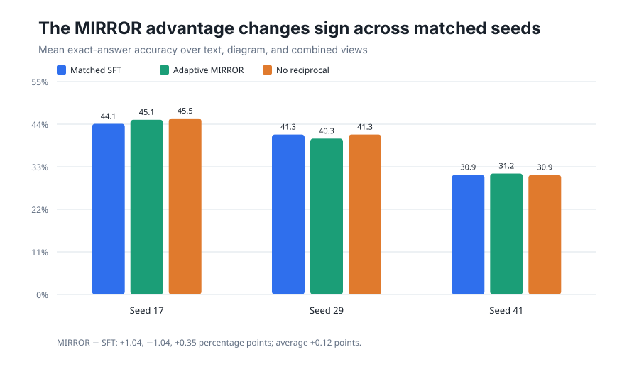

# MIRROR claim reproduction on public geometry views

[](https://molab.marimo.io/github/alphaXiv/mirror-learning-from-the-other-view-for-multi-mo/blob/main/notebooks/mirror_reproduction.py)

This repository tests the central claim of [MIRROR: Learning from the Other View for Multi-Modal Reasoning](https://arxiv.org/abs/2607.21552): equivalent text, diagram, and combined views reveal complementary VLM failures, and the strongest view can teach the weaker ones.

**Assessment: partially reproduced.** On 96 held-out Geometry3K problems, Qwen3-VL-4B-Instruct disagreed across views on **62.5%** and showed complementary success on **29.2%**. Ordinary LoRA training substantially improved accuracy and consistency. Default reciprocal reverse KL (λ=.01) averaged only **+0.12 percentage points** over matched SFT across three seeds and was slightly worse on all-view correctness; tuned λ=.05 beat SFT at seed 17 and tied it at seed 29 while improving agreement.

The paper reports both-view solvability rising from **42.5% to 60.7%** with MIRROR, versus **53.6%** with standard GRPO. Our closest bounded result is different and not numerically comparable: at seed 17, all-three-view correctness was **37.5%** with tuned λ=.05, **31.25%** with SFT, and **34.38%** without reciprocal loss. We substitute MIT-licensed Geometry3K for unavailable ODA-Data, 128 training problems for about 2,000, 16 LoRA updates for long-horizon 16-rollout GRPO, greedy pass@1 for pass@16, and a frozen-base gold-trajectory token-level reverse-KL approximation for the paper’s online EMA teacher.

All formal evidence ran on the configured **Kubernetes** cluster using **NVIDIA RTX PRO 6000 Blackwell** GPUs: 4 GPUs per job, **16 peak concurrently allocated GPUs**, and **0.3121 actual wall hours** from the first successful instrumented run to the final successful completion.

- [Detailed illustrated report](reports/mirror-geometry3k/report.md)
- [Self-contained tutorial notebook](notebooks/mirror_reproduction.py)
- [Embedded result summary](reports/mirror-geometry3k/results.json)

## Headline result



Default MIRROR’s mean-accuracy difference against SFT was +1.04, −1.04, and +0.35 points at seeds 17, 29, and 41. This small, sign-changing effect is why the verdict is partial despite the strong baseline disagreement and the positive tuned-loss result.

## Experiment log

The exact fixed run command for every formal node was `bash scripts/run_k8s.sh`; code/config changes live on each linked branch.

| Branch / experiment | Purpose or change | Exact run command | Assessment / outcome | Compute |
|---|---|---|---|---|
| `main` | Public report, notebook, results, and implementation | Not run as an experiment (publication surface) | Presentation-only | — |
| [Operational baseline](https://github.com/alphaXiv/mirror-learning-from-the-other-view-for-multi-mo/tree/orx/k8s-launcher-compatibility-baseline) | Frozen Qwen3-VL-4B pass@1 across three views | `bash scripts/run_k8s.sh` | 16.7% text, 14.6% diagram, 21.9% combined; 62.5% disagreement | Kubernetes, 4× RTX PRO 6000 Blackwell, 99 s |
| [Matched SFT](https://github.com/alphaXiv/mirror-learning-from-the-other-view-for-multi-mo/tree/orx/peft-compatible-matched-sft) | Ordinary answer-supervised LoRA, seed 17 | `bash scripts/run_k8s.sh` | 44.10% mean accuracy; 31.25% all-view correct | Kubernetes, 4× RTX PRO 6000 Blackwell, 92.1 s |
| [Adaptive MIRROR λ=.01](https://github.com/alphaXiv/mirror-learning-from-the-other-view-for-multi-mo/tree/orx/peft-compatible-adaptive-reciprocal) | Best-view teacher plus reciprocal loss, seed 17 | `bash scripts/run_k8s.sh` | 45.14% mean; 34.38% all-view correct; balanced teacher choices | Kubernetes, 4× RTX PRO 6000 Blackwell, 150.8 s |
| [No reciprocal loss](https://github.com/alphaXiv/mirror-learning-from-the-other-view-for-multi-mo/tree/orx/peft-compatible-no-reciprocal) | Adaptive selection, λ=0 mechanism ablation | `bash scripts/run_k8s.sh` | 45.49% mean; 34.38% all-view correct—default loss not isolated | Kubernetes, 4× RTX PRO 6000 Blackwell, 154.1 s |
| [Fixed text](https://github.com/alphaXiv/mirror-learning-from-the-other-view-for-multi-mo/tree/orx/peft-compatible-fixed-text-teacher), [fixed image](https://github.com/alphaXiv/mirror-learning-from-the-other-view-for-multi-mo/tree/orx/peft-compatible-fixed-image-teacher), [fixed combined](https://github.com/alphaXiv/mirror-learning-from-the-other-view-for-multi-mo/tree/orx/peft-compatible-fixed-combined-teacher) | Teacher-selection ablations, seed 17 | `bash scripts/run_k8s.sh` | Adaptive narrowly best in mean; other metrics mixed | Kubernetes, 4× each, 111–118 s |
| [Adaptive λ=.05](https://github.com/alphaXiv/mirror-learning-from-the-other-view-for-multi-mo/tree/orx/adaptive-reciprocal-kl-0-05) | Stronger reciprocal-loss coefficient, seed 17 | `bash scripts/run_k8s.sh` | Best seed-17 result: 46.53% mean, 37.50% all-view correct | Kubernetes, 4× RTX PRO 6000 Blackwell, 151.4 s |
| [λ=.001](https://github.com/alphaXiv/mirror-learning-from-the-other-view-for-multi-mo/tree/orx/adaptive-reciprocal-kl-0-001), [λ=.005](https://github.com/alphaXiv/mirror-learning-from-the-other-view-for-multi-mo/tree/orx/adaptive-reciprocal-kl-0-005) | Reverse-KL sensitivity | `bash scripts/run_k8s.sh` | Non-monotonic; 43.40% and 45.49% mean | Kubernetes, 4× each, 151–154 s |
| [SFT seed 29](https://github.com/alphaXiv/mirror-learning-from-the-other-view-for-multi-mo/tree/orx/matched-sft-seed-29), [MIRROR seed 29](https://github.com/alphaXiv/mirror-learning-from-the-other-view-for-multi-mo/tree/orx/adaptive-reciprocal-seed-29), [SFT seed 41](https://github.com/alphaXiv/mirror-learning-from-the-other-view-for-multi-mo/tree/orx/matched-sft-seed-41), [MIRROR seed 41](https://github.com/alphaXiv/mirror-learning-from-the-other-view-for-multi-mo/tree/orx/adaptive-reciprocal-seed-41) | Matched robustness seeds | `bash scripts/run_k8s.sh` | Default MIRROR − SFT: −1.04 points at seed 29, +0.35 at seed 41 | Kubernetes, 4× each, 91–149 s |

## Reproduce the bounded protocol

The Kubernetes job downloads Geometry3K at run time; no dataset or credentials are committed.

```bash
bash scripts/run_k8s.sh
```

The experiment tree keeps method settings in `configs/experiment.json` on each branch. Formal runs must be launched through `orx exp run <experiment-id> --backend k8s`, not by invoking training directly on a workstation.
