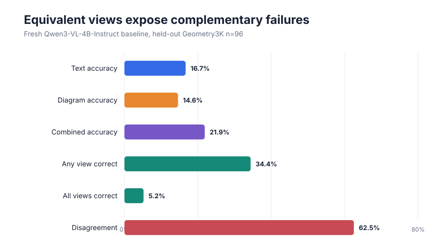
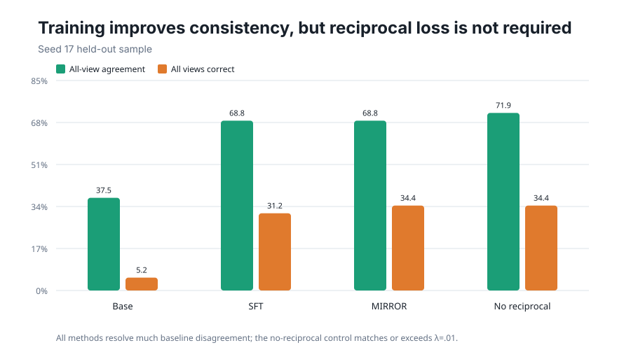
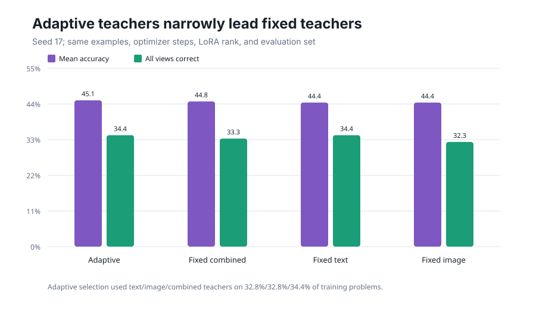
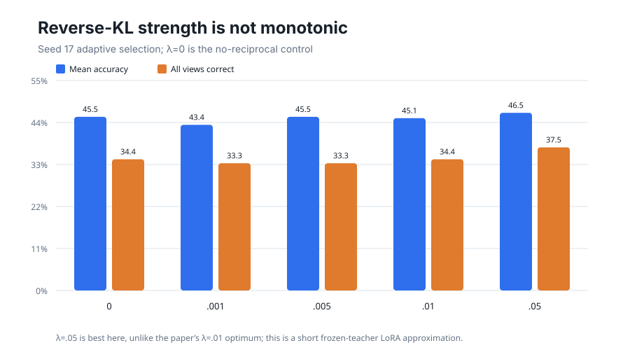

# MIRROR on public paired geometry views

A vision-language model can answer the same geometry problem differently when it sees words, a diagram, or both. The MIRROR paper turns that inconsistency into a lesson: for each problem, the view that works best teaches the weaker views. This reproduction tested whether that idea survives a small, public-data implementation on the user’s Kubernetes cluster.

**Verdict: partially reproduced.** The diagnostic claim is clear: 62.5% of held-out problems produced cross-view disagreement, and 29.2% had a correct answer in some but not all views. Adaptive teacher selection narrowly beat every fixed teacher at seed 17, but reciprocal distillation did not robustly beat matched supervised training across three seeds.

**Scope.** We used 128 training and 96 held-out [Geometry3K/InterGPS](https://github.com/lupantech/InterGPS) problems per seed with Qwen3-VL-4B-Instruct. This is not the paper’s unavailable ODA-Data or full 64-H200, 16-rollout GRPO recipe.

Read each seed as a matched comparison: all three methods saw the same sampled problems and took 16 optimizer steps. MIRROR’s advantage over SFT changes from +1.04 to −1.04 to +0.35 percentage points; the average is only +0.12 points. The orange control also performs teacher selection but removes reciprocal reverse-KL.

## What was tested

The paper reports 29.58%, 10.54%, and 26.84% pass@1 for text, image, and combined ODA-Train views, with both-view solvability rising from 42.5% for the base model to 53.6% after standard GRPO and 60.7% after MIRROR. Its strongest held-out result improves image pass@16 from 48.78% to 57.06% and text pass@16 from 83.16% to 86.10% over the best single-view GRPO baselines.

Our public reconstruction retains Geometry3K questions and released diagrams. A text view serializes the released text and diagram logic forms; an image view uses the diagram and question; the combined view contains both. The official validation split was held out before view construction. All images opened successfully, and 97.84% of 788 audited structured lines had resolvable endpoints.

The combined view was best on average, but no view dominated every problem. Any-view accuracy was 34.38%, more than double diagram-only accuracy, while only 5.21% were correct in all three views. This strongly aligns with the paper’s complementary-success diagnosis, though the datasets and prompts differ.

## Matched training

Every branch trained rank-8 LoRA adapters on the same 128 paired problems, two restricted student views, and 16 optimizer steps. SFT learned the gold answer. The MIRROR approximation additionally chose the best greedy text/image/combined completion for each training problem and applied token-level reverse-KL on the same gold-answer trajectory using the frozen base model as teacher. This preserves per-problem teacher choice and reverse-KL direction, but replaces on-policy GRPO, 16 rollouts, and an EMA teacher.

| Seed | SFT mean | MIRROR mean | No reciprocal | MIRROR − SFT | MIRROR − no loss |
|---:|---:|---:|---:|---:|---:|
| 17 | 44.10% | 45.14% | 45.49% | +1.04 | −0.35 |
| 29 | 41.32% | 40.28% | 41.32% | −1.04 | −1.04 |
| 41 | 30.90% | 31.25% | 30.90% | +0.35 | +0.35 |

Training clearly resolves baseline inconsistency, but the mechanism attribution is weak. At seed 17, all-view correctness rose from 5.21% to 31.25% with SFT and 34.38% with MIRROR; no-reciprocal also reached 34.38% and had higher raw agreement. Across seeds, MIRROR’s all-view-correct advantage over SFT was +3.13, −4.17, and 0.00 points.

## Mechanism checks

Adaptive selection used all sources—32.8% text, 32.8% image, and 34.4% combined—and reached 45.14% mean accuracy. Fixed combined, text, and image teachers reached 44.79%, 44.44%, and 44.44%. This narrowly supports problem-specific teacher choice, but the 96-example sample is too small for a strong causal claim.

The coefficient result diverges from the paper. Here λ=0.05 was best at seed 17 (46.53% mean; 37.50% all-view correct), while λ=0.01 reached 45.14%; λ=0 matched or exceeded λ=0.01 on several metrics. At seed 29, λ=0.05 matched SFT’s 41.32% mean, whereas λ=0.01 fell to 40.28%. The short frozen-teacher approximation therefore does not isolate a reverse-KL benefit or reproduce the paper’s λ=0.01 optimum.

## Claim-by-claim assessment

| Claim | Paper evidence | Observed evidence | Assessment |
|---|---|---|---|
| Equivalent views expose complementary successes | Large ODA view gaps; problem-specific best views | 62.5% disagreement; 29.2% complementary success | **Aligned** |
| MIRROR improves matched training | +8.28 image and +2.94 text pass@16 vs strongest single-view GRPO | Mean delta vs SFT: +1.04, −1.04, +0.35 points | **Inconclusive here** |
| Adaptive teachers beat fixed teachers | Adaptive leads most Table 3 metrics | +0.35–0.69 mean points over fixed teachers at seed 17 | **Partially aligned** |
| Reciprocal reverse-KL is causal | λ=0.01 selected; ablations favor mechanism | No-loss equal/better in two of three seeds; λ=0.05 best locally | **Not isolated here** |

## Compute and limitations

All formal runs used Kubernetes and 4 NVIDIA RTX PRO 6000 Blackwell GPUs each, peaking at 16 concurrent GPUs. The successful instrumented campaign ran from 02:35:27Z to 02:54:10.555Z on 2026-07-27: **0.3121 elapsed wall-hours**. Each method used 128 training problems, 96 held-out problems, and 16 adapter updates.

The paper trained Qwen3-VL-4B with GRPO for at least 200 steps on 64 H200 GPUs, 16 rollouts per prompt, 2,000 asymmetry-filtered ODA examples, and an fp32 EMA teacher. Dataset substitution, answer-only LoRA, greedy teacher selection, a frozen teacher, and pass@1 are consequential; these results assess the selected mechanism under the bounded public setup, not the paper’s full-scale numbers.

[Open the self-contained notebook](../../notebooks/mirror_reproduction.py) · 

